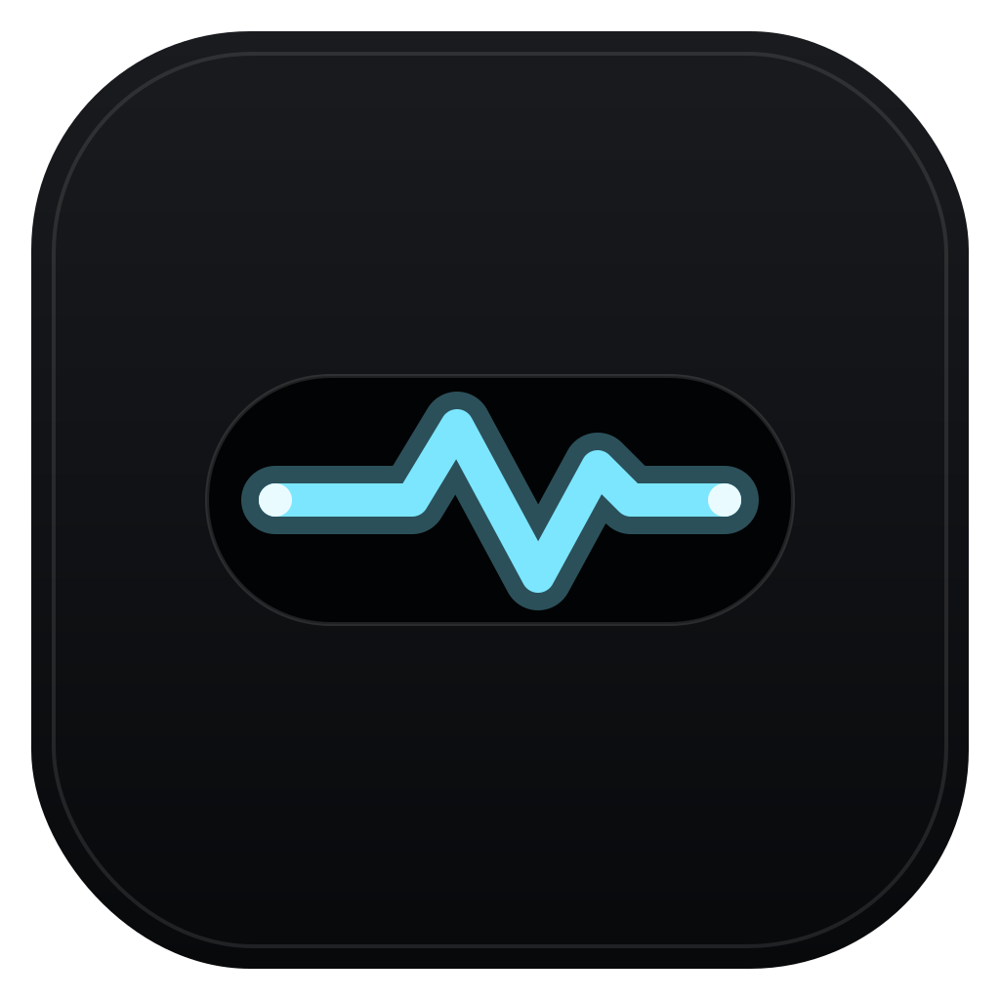
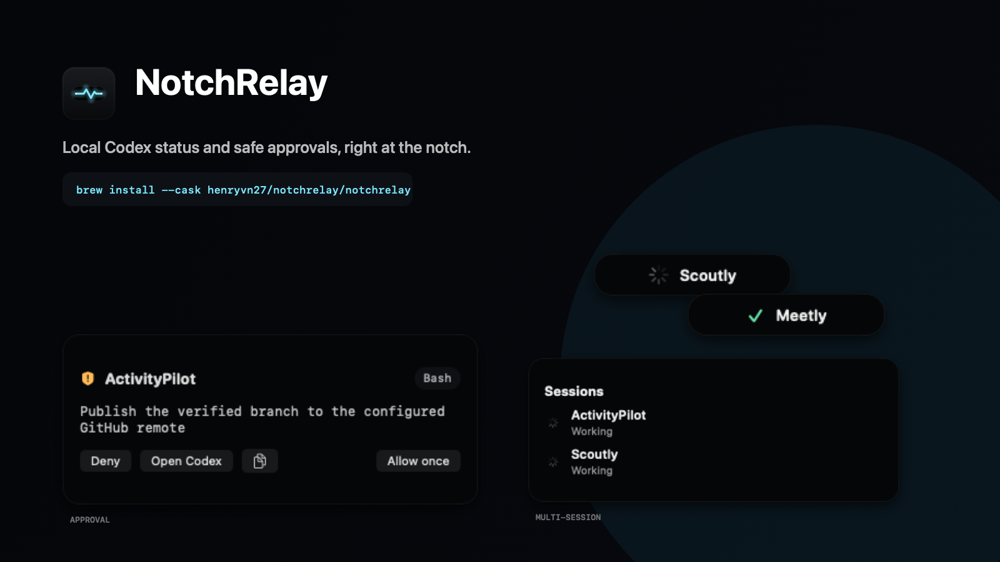

<p align="center"></p>
<h1 align="center">NotchRelay</h1>
<p align="center"><strong>Codex status and safe approval actions, right at the MacBook notch.</strong></p>
<p align="center"><a href="https://github.com/henryvn27/notchrelay/releases/latest">Download</a> · <a href="docs/security.md">Security</a> · <a href="docs/privacy.md">Privacy</a> · <a href="docs/troubleshooting.md">Troubleshooting</a></p>



```sh
brew install --cask henryvn27/notchrelay/notchrelay
```

NotchRelay is a native, local-first macOS companion for OpenAI Codex. It stays hidden while idle, shows active projects and completion near the notch, and lets you allow once or deny supported Codex permission requests without becoming a second Codex client.

## What it does

- Shows working, approval, completed, failed, and multi-session states.
- Uses official Codex lifecycle hooks; it does not parse transcripts.
- Matches approval decisions to a unique pending request and never defaults to Allow.
- Falls back to Codex's normal approval UI if the app is unavailable, disconnected, malformed, or timed out.
- Uses the built-in display's real safe-area geometry; non-notch Macs get a compact top-center island.
- Optionally pulses the Caps Lock LED while preserving its original state.
- Keeps prompt and result previews off by default.

## Install

### Homebrew

```sh
brew install --cask henryvn27/notchrelay/notchrelay
```

### GitHub release

Download the notarized DMG from [Releases](https://github.com/henryvn27/notchrelay/releases/latest), drag NotchRelay to Applications, and open it. Complete onboarding to detect Codex, safely merge the four lifecycle hooks, and run a local visual test.

Normal installation requires no Xcode, Swift, Python, Node, npm, account, or cloud service.

## Approval safety

NotchRelay's Allow button is never the default action. Every response contains the exact request UUID received from the helper. A timeout, invalid token, stale event, malformed response, mismatched UUID, unavailable app, or broken socket returns no decision, so Codex continues with its own normal approval prompt. Tool input is display-only and is never executed by NotchRelay.

## Supported systems

- macOS 14 Sonoma or newer.
- Apple Silicon and Intel through a universal release binary.
- Notched and non-notched Macs, external displays, multiple displays, Spaces, and full-screen auxiliary presentation where macOS permits it.

## Privacy

NotchRelay has no analytics, cloud backend, account, ads, or third-party crash reporter. Its only network request is Sparkle's signed update check and links you explicitly open. It does not persist full prompts, commands, or session history. See [PRIVACY.md](PRIVACY.md) for every stored file and permission.

## How it works

Codex invokes the bundled `notchrelay-hook` helper for `SessionStart`, `UserPromptSubmit`, `PermissionRequest`, and `Stop`. The helper sends authenticated, versioned newline-delimited JSON over a private Unix-domain socket. The native app arbitrates independent session state and returns synchronous approval decisions only when the request is still current.

See [architecture](docs/architecture.md) and the [bridge protocol](docs/protocol.md).

## Development

Requirements: macOS 14+, Xcode 16 or newer, and XcodeGen.

```sh
git clone https://github.com/henryvn27/notchrelay.git
cd notchrelay
brew install xcodegen
./Scripts/build_and_run.sh --verify
```

The project-local Codex Run action uses the same command. Contributor installation is available through `./Scripts/install_local.sh`; normal users should use Homebrew or a release.

## Contributing

Read [CONTRIBUTING.md](CONTRIBUTING.md). Security reports belong in a private [GitHub security advisory](https://github.com/henryvn27/notchrelay/security/advisories/new), not a public issue.

NotchRelay is MIT licensed. It is an unofficial community project and is not affiliated with, endorsed by, or sponsored by OpenAI. OpenAI and Codex are trademarks of their respective owners.
