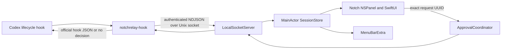

# Architecture

NotchRelay is a SwiftUI menu-bar accessory with a narrow AppKit windowing bridge and a Swift command-line helper.

`Models` owns versioned values and session state; `Stores` owns arbitration and preferences; `Services` owns IPC, approval, installation, Caps Lock, updates, activation, login, and diagnostics; `Windowing` owns safe-area geometry and the tightly bounded panel; `Views` owns presentation and onboarding. `NotchRelayHook` is the standalone decoder and bridge client.

All session mutations run on the main actor. Socket work uses a dedicated queue. Project-name resolution runs off-main without a Git subprocess. The overlay is ordered out with no animation loop while idle.

Sessions are keyed by Codex `session_id`. Priority is approval, failed, working, recently completed, idle. Only the first unexpired approval UUID can be decided. Completed sessions leave presentation after the configured interval and are removed after 15 minutes.
